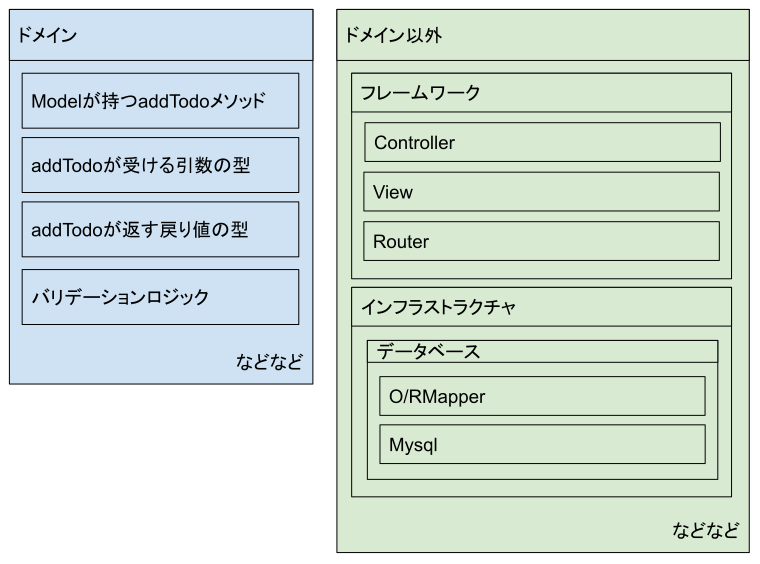
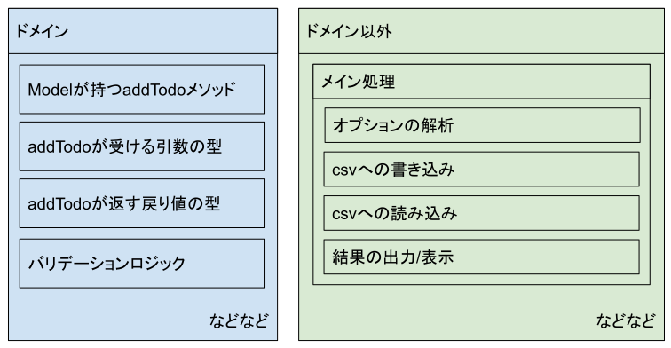
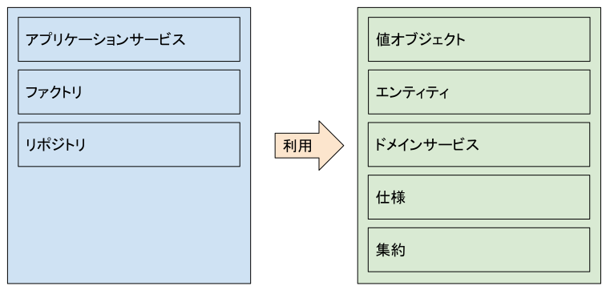
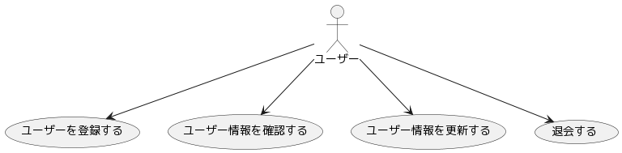

# DDD 入門

## 概要

- [エリック・エヴァンスのドメイン駆動設計](https://www.amazon.co.jp/dp/4798121967/)

### DDDとは

`ソフトウェアの核心にある複雑さに立ち向かう`

> まずは、DDDとは何か、から始めましょう。そもそも「ドメイン」とは、アプリケーションが対象とする業務領域のことです。本書では、ドメインを「知識、影響力、活動の一領域」と定義しています。
> DDDは、オブジェクト指向コミュニティの間で長年培われてきたドメインモデリングのノウハウやベストプラクティスを集大成した、1つの設計思想／哲学です。ドメインモデルをこれから構築しようとする人に、設計上の判断を下すための枠組みと、ドメイン設計について議論するためのボキャブラリを提供するものです。

*[Domain-Driven Designのエッセンス](https://www.ogis-ri.co.jp/otc/hiroba/technical/DDDEssence/chap1.html)より引用

### DDDの目的

`ソフトウェアの価値を高めること`

`ソフトウェアの機能性と保守性の両方を高めること`

噛み砕くと

1. 価値のあるソフトウェアを開発したい
2. (誤解を恐れず言えば)価値のあるソフトウェアの要件は大抵複雑
3. ソフトウェアはジェンガで機能を積めば積むほど崩壊しやすい
  - 複雑で解析に時間がかかる
  - 影響範囲の特定に時間がかかる
  - 慎重に開発が必要になる
4. DDD(やクリーンアーキテクチャ)は土台から固めて機能を積む
  - 初期コストはかかる(学習コストやコード量が多い)
  - 長期的なメンテナンス性や安定したリリース周期に貢献する

DDDの導入は `コードの品質を上げること` も一つの目的かもしれないが、

ドメインエキスパート(開発しているソフトウエアの適用領域に深く通じている人)とのコミュニケーション(ヒアリングや要件定義や定例MTGなど)を通して対象ドメインへのより深い理解を得て、顧客ですら見えていない問題解決のための機能性を持った `価値のあるソフトウェア` を作ることが目的です。

[顧客が本当に必要だったもの](https://dic.nicovideo.jp/a/%E9%A1%A7%E5%AE%A2%E3%81%8C%E6%9C%AC%E5%BD%93%E3%81%AB%E5%BF%85%E8%A6%81%E3%81%A0%E3%81%A3%E3%81%9F%E3%82%82%E3%81%AE)にも通ずる話

また、DDDのプラクティスを実践することで長期的なメンテナンス性や安定したリリース周期に貢献し、ひいてはそれも含めた `価値のあるソフトウェア` を作ることも目的です。

### 根本的なDDDの3原則

> - コアドメインに集中すること
> - ドメインの実践者とソフトウェアの実践者による創造的な共同作業を通じて、モデルを探求すること
> - 明示的な境界づけられたコンテキストの内部で、ユビキタス言語を語ること

*[ドメイン駆動設計入門 成瀬允宣(著)](https://www.amazon.co.jp/%E3%83%89%E3%83%A1%E3%82%A4%E3%83%B3%E9%A7%86%E5%8B%95%E8%A8%AD%E8%A8%88%E5%85%A5%E9%96%80-%E3%83%9C%E3%83%88%E3%83%A0%E3%82%A2%E3%83%83%E3%83%97%E3%81%A7%E3%82%8F%E3%81%8B%E3%82%8B-%E3%83%89%E3%83%A1%E3%82%A4%E3%83%B3%E9%A7%86%E5%8B%95%E8%A8%AD%E8%A8%88%E3%81%AE%E5%9F%BA%E6%9C%AC-%E6%88%90%E7%80%AC-%E5%85%81%E5%AE%A3/dp/479815072X)より引用

### 今回のハンズオンで学ぶ範囲

DDDは設計思想/哲学とあるように広く実践的なプラクティスの集大成で、プログラマーだけで実践/完結するものではありません。

が、今回のハンズオンでは主にプログラマーだけで実践できる `コアドメインに集中すること` について深掘ります。

俗に `戦術的DDD` または `軽量DDD` と呼ばれています。

ドメインが何か、なぜ重要なのか知ることで様々なアーキテクチャへの理解につながります。

様々なアーキテクチャへの理解することで、様々なプロジェクトで必要なシーンに遭遇した時、設計する上での選択肢を増やすことができます。

## ドメインとは

> 「ドメイン」とは、アプリケーションが対象とする業務領域のことです。

プログラミングにおけるドメインでいうと

`4層アーキテクチャ` の `ドメイン層`

- プレゼンテーション層 (UIを含むリクエストやレスポンスで外部をやりとりする層)
- アプリケーション層 (全体をコントロールするプレゼンテーション層とドメイン層の仲介役)
- ドメイン層 (オブジェクトや型、ロジックを含むモデル化された業務仕様、ビジネスロジック)
- インフラストラクチャ層 (DBや外部システムとの連携など環境に依存する実装)

`MVC(or MVC2)アーキテクチャ` の `Model`

- Controller (リクエストを受け付け、Modelを呼び出して処理し、Viewに伝えてレスポンスを返す)
- Model (オブジェクトや型、ロジックを含むモデル化された業務仕様、ビジネスロジック)
- View (モデルを元にHTMLへ整形してUI、またはJSONを整形してレスポンスを出力)

*DAO(Data Access Object)やOR/Mapperを含んだモデルのことではないことには注意

### 具体例

ドメインはシステム化する上で必ず必要になるロジックやオブジェクトと置き換えて考えてもらって構いません。

TODOリストアプリケーションの場合、以下のようなロジックやオブジェクトがドメインとなります。

- Modelが持つaddTodo
- addTodoが受ける引数の型
- addTodoが返す戻り値の型
- バリデーションロジック(同じ名前のタスクは登録できない等)

DBへ接続するTODOリストWebアプリケーションの例で考えてみましょう。



CSVへ保存するCLIツールとしてTODOリストを実装する場合はこうなります。



解決手段は変わったものの、ドメインは変わっていません。

フレームワークやデータベースはシステム化する上で必ず必要になるロジックやオブジェクトではない外側の知識であることがわかります。

また、スマホアプリや組み込みシステムなど、ソリューションが違っても変わらない知識がドメインです。


## ドメインの構成要素

DDDにおけるドメインは以下の要素に分けられて定義されます。

- 知識を表現するパターン
  - 値オブジェクト
  - エンティティ
  - ドメインサービス
- アプリケーションを実現するためのパターン
  - リポジトリ
  - アプリケーションサービス
  - ファクトリ
- 知識を表現する、より発展的なパターン
  - 集約
  - 仕様

それぞれを深ぼる前にざっくり構成要素と関係についてみてみましょう。




## 値オブジェクト

システム固有の値を表現するものが `値オブジェクト` で、以下の特徴があります。

- 不変である
- 交換可能である
- 等価性によって評価される

コードで例をみてみましょう。

以下はフルネームを表現する値オブジェクトの例です。

`./ddd/01value-object/domain/value-object/fullname.go`

```go
package valueobject

type FullName struct {
	firstName string
	lastName  string
}

func NewFullName(firstName string, lastName string) *FullName {
	fullName := &FullName{
		firstName: firstName,
		lastName:  lastName,
	}
	return fullName
}

func (f FullName) Equals(fullName *FullName) bool {
	return f.firstName == fullName.firstName && f.lastName == fullName.lastName
}
```

`./ddd/01value-object/main.go`

```go
fullName1 := vo.NewFullName("Moriyuki", "Arakawa")

// 不変である
//   不変なので以下のような内部の値を変更するメソッドや直接書き換え可能な公開プロパティを持たない
fullName1.ChangeFirstName("盛幸")
fullName1.ChangeLastName("新川")
fullName1.FirstName = "盛幸"
fullName1.LastName = "新川"

// 交換可能である
//   なので代入は可能
fullName1 = vo.NewFullName("Moriyuki", "Arakawa")

// 等価性によって評価される
//   なので比較用メソッドを持っている
fullName2 := vo.NewFullName("盛幸", "新川")
fullName1.Equals(fullName2)
log := fmt.Sprintf("Equals: %t", fullName1.Equals(fullName2))
fmt.Println(log)
```

値オブジェクトは不変なので、`ChangeFirstName` や `ChangeLastName` のような内部の値を破壊的に変更するようなメソッドを持ってはいけません。

プリミティブ型(基本データ型)の `string` や `int` のように不変です。

交換可能なので代入は可能です。

等価性によって評価されるので、比較用メソッドを持っています。

---

値オブジェクトを定義していない場合、同じ名前か調べる処理があれば至る所に同じfirstNameとlastNameの比較処理が書かれることになります。

後にミドルネーム対応など仕様変更があった場合、FullNameというドメイン知識を値オブジェクトが表現してくれているので属性が追加されても修正が最小限になります。

---

値オブジェクトは振る舞いをもつことができます。

以下はお金を表現し、足し算ができる値オブジェクトの例です。

`./ddd/01value-object/domain/value-object/money.go`

```go
package valueobject

import (
	"errors"
	"fmt"
)

type Money struct {
	ammount  int
	currency string
}

func NewMoney(ammount int, currency string) *Money {
	money := &Money{
		ammount:  ammount,
		currency: currency,
	}
	return money
}

func (m Money) Equals(money *Money) bool {
	return m.currency == money.currency && m.ammount == money.ammount
}

func (m Money) Add(money *Money) (*Money, error) {
	if m.currency != money.currency {
		return nil, errors.New("通貨単位が異なります")
	}

	return NewMoney(m.ammount+money.ammount, money.currency), nil
}

func (m Money) ToString() string {
	return fmt.Sprintf("%d(%s)", m.ammount, m.currency)
}
```

`./ddd/01value-object/main.go`

```go
// 値オブジェクトは振る舞いをもつことができる
//   Addメソッドは変更ではなく新しい合計Moneyインスタンスを返す
jpMoney1 := vo.NewMoney(100, "JPY")
jpMoney2 := vo.NewMoney(200, "JPY")
totalMoney, _ := jpMoney1.Add(jpMoney2)
fmt.Println(fmt.Sprintf("Total: %s", totalMoney.ToString()))

// 日本円とドルは加算できないというドメイン知識を表現する
usMoney := vo.NewMoney(300, "USD")
_, err := jpMoney1.Add(usMoney)
if err != nil {
  fmt.Println(err)
}
```

自身を変更しない限り、メソッドは自由に作ることができます。

値オブジェクトの足し算などは自身への変更ではなく新しい合計Moneyインスタンスを返すようにします。

また、日本円とドルは加算できないというドメイン知識を表現することもできます。

---

他にも値オブジェクトは以下のようなプラクティスで実装することができます。

- 不正な値を存在させない
  - フルネームは姓と名はそれぞれ1文字以上、お金は0以上などのルールをコンストラクタで検証してエラーを返すなど
- 謝った代入を防ぐ
  - IDとint型を明確に区別するため、UserIdなどの値オブジェクトを用意する
- ロジックの散在を防ぐ
  - バリデーションを値オブジェクトに持たせることで、作成や更新時の検証処理を散在させない


## エンティティ

ライフサイクルのあるオブジェクトが `エンティティ` で、以下の特徴があります。

- 可変である
- 同じ属性であっても区別される
- 同一性により区別される

コードで例をみてみましょう。

まずは `エンティティ` であるユーザーオブジェクトが使う `値オブジェクト` から見てみます。

`./ddd/02entity/domain/value-object/user.go`

```go
package valueobject

import (
	"errors"
)

type UserId struct {
	value int
}

func NewUserId(id int) (*UserId, error) {
	if id < 1 {
		return nil, errors.New("ユーザーIDは1以上である必要があります")
	}

	userId := &UserId{
		value: id,
	}
	return userId, nil
}

type UserName struct {
	value string
}

func NewUserName(name string) (*UserName, error) {
	if len(name) < 3 {
		return nil, errors.New("ユーザー名は3文字以上である必要があります")
	}

	userName := &UserName{
		value: name,
	}
	return userName, nil
}
```

`User` エンティティが利用する `UserId` や `UserName` の値オブジェクト定義しています。

それぞれの値オブジェクトは `何文字以上` などのドメイン知識がコードに反映されています。

ドメイン知識を反映せず、単純なsetter/getterでも実装可能ですが、DDDではコードのドキュメント性を高めるため、正しい仕様を正しいオブジェクトに記載します。

これにより、ドメインモデル貧血症やロジックの分散を防ぐことができます。

次は本題であるユーザーを表現するエンティティの例です。

`./ddd/02entity/domain/entity/user.go`

```go
package entiry

import (
	vo "main/domain/value-object"
)

type User struct {
	Id   vo.UserId
	Name vo.UserName
}

func NewUser(id vo.UserId, name vo.UserName) *User {
	user := &User{
		Id:   id,
		Name: name,
	}
	return user
}

func (u User) Equals(user *User) bool {
	return u.Id == user.Id
}

func (u *User) ChangeName(name vo.UserName) {
	u.Name = name
}
```

`./ddd/02entity/main.go`

```go
userId, err := vo.NewUserId(1)
if err != nil {
  fmt.Println(err)
}
userName, err := vo.NewUserName("新川 盛幸")
if err != nil {
  fmt.Println(err)
}
user := entity.NewUser(*userId, *userName)

// 可変である
//   ので名前を変更することができる
newUserName, err := vo.NewUserName("Moriyuki Arakawa")
if err != nil {
  fmt.Println(err)
}
log := fmt.Sprintf("旧User id:%d name:%s", user.Id, user.Name)
fmt.Println(log)
user.ChangeName(*newUserName)
log = fmt.Sprintf("新User id:%d name:%s", user.Id, user.Name)
fmt.Println(log)

// 同じ属性であっても区別される
//   のでIDが同じではない限り区別される
userId2, err := vo.NewUserId(2)
if err != nil {
  fmt.Println(err)
}
userName2, err := vo.NewUserName("Moriyuki Arakawa")
if err != nil {
  fmt.Println(err)
}
user2 := entity.NewUser(*userId2, *userName2)
log = fmt.Sprintf("Equals: %t", user.Equals(user2))
fmt.Println(log)

// 同一性により区別される
//   のでIDが同じなら同一とされる
user3 := entity.NewUser(*userId, *userName2)
log = fmt.Sprintf("Equals: %t", user.Equals(user3))
fmt.Println(log)
```

ユーザーは名前や年齢、身長など変更される可能性のあるエンティティです。

可変であるので名前を変更することができます。

ただ、同姓同名のユーザーもいるので、同じ名前(属性)であっても区別されます。

同一性により区別されるので `ID` (やメモリアドレス)により区別されます。

*基本的に可変なオブジェクトは厄介で、全ての値を可変にする必要はありません。必要に応じて属性を可変にすることが許されてるに過ぎません。


## ドメインサービス

不自然さを解決するオブジェクトが `ドメインサービス` です。

不自然さとは何かを説明します。

例として、システムによってユーザー名の重複を許さないパターンもあるでしょう。

ユーザー名の重複を許さないというのはドメインのルールで、ドメインに書く必要があります。

先ほどのユーザーオブジェクトに重複確認の関数をはやしてみます。

```go
user := entity.NewUser(*userId, *userName)

if user.Exists(user) {
  // 重複している
} else {
  // 重複していない
}
```

これはメソッドとして定義した場合の `user.Exists()` も同様ですが、ユーザーオブジェクト自身に問い合わせています。

この場合、重複チェックが自身を含めているのか、自身を除外しているのか、不明瞭です。

こういった処理をユーザーオブジェクトに定義すると開発者を惑わせます。

以下のようなドメインサービスを定義して不自然さを解決してみましょう。

`./ddd/03domain-service/domain/domain-service/user.go`

```go
package domainservice

import (
	entity "main/domain/entity"
)

func UserExists(user entity.User) bool {

	// TODO: 重複確認処理
	exists := false

	return exists
}
```

`./ddd/03domain-service/main.go`

```go
user := entity.NewUser(*userId, *userName)

ds.UserExists(*user)
```

*具体的な処理内容は本質ではないため省略しています。

ドメインサービスは状態を持たないオブジェクト(または関数など)です。

値オブジェクトやエンティティに定義すると不自然になる関数はドメインサービスに定義しましょう。

---

複数の値オブジェクトやエンティティが絡む処理などはドメインサービスに定義する方がいいでしょう。

ドメインサービスは便利でなんでも定義できてしまうサービスです。濫用はかえってドメインモデルがドメイン意識を語らない `ドメインモデル貧血症` を起こすことにつながります。

例えばUserServiceにChangeNameを定義するなどドメインサービスに過剰な責任を押し付ける一つの例です。

---

ドメイン全般に言えますが、UserService.Existsにはデータベースの操作などドメインの外側の知識を書いてはいけません。

DBの操作をせずに重複確認ができるのか、実際問題どうするかは次のリポジトリで解決します。


## リポジトリ

データにまつわる処理を分離するオブジェクトが `リポジトリ` で、永続化処理を担当しています。

先ほどのセクションで、リポジトリ以外でデータベースの操作はしてはいけない話をしましたが、全てリポジトリを通して操作されます。

リポジトリを経由して操作するだけですが、ソフトウェアに柔軟性を与えます。

リポジトリの実装を見てみましょう。

`./ddd/04repository/domain/repository/user.go`

```go
package repository

import (
	entity "main/domain/entity"
)

type UserRepositoryInterface interface {
	Exists(user entity.User) bool
}

type UserRepository struct{}

func NewUserRepository() UserRepositoryInterface {
	repository := &UserRepository{}
	return repository
}

func (r *UserRepository) Exists(user entity.User) bool {

	// TODO: DBからuser.Idのレコードがあるか確認する処理
	exists := false

	return exists
}
```

具体的な処理内容は本質ではないため省略していますが、リポジトリはDBの操作が許されています。

実際はコンストラクタである `NewUserRepository` にORMやDBクライアントなどのインスタンスが渡され、`Exists` メソッドにその操作が定義されます。

また、ユーザーを検索する `Find` や `Create` や `Delete` なども定義されるでしょう。

利用側であるドメインサービスの実装も見てみましょう。

`./ddd/04repository/domain/domain-service/user.go`

```go
package domainservice

import (
	entity "main/domain/entity"
	repository "main/domain/repository"
)

func UserExists(user entity.User) bool {
	userRepository := repository.NewUserRepository()

	exists := userRepository.Exists(user)

	return exists
}
```

ドメインサービスからDBの操作についての知識が剥がれました。

実のところ、ドメインサービスが依存しているのは `UserRepository` という実装ではなく `UserRepositoryInterface` という抽象(インターフェース)です。

これは `依存性逆転の原則` というクリーンアーキテクチャにも共通するプラクティスです。

インターフェースだけに依存すると利用側(ドメインサービス)は `Exists` という重複処理を持っていることしか知りませんが、フレームワークやデータベースなど外側の知識は何も知らなくて良くなります。

これは最初のセクションで説明した `コアドメインに集中すること` に対しての回答にもなります。

例えばmysqlがredisに変わってもリポジトリインターフェースが持つ `Exists` の定義は変わることがありません。

ドメインではなくアプリケーションの関心事であるリポジトリの処理を分けることで、以下を達成できます。

- 環境が変わってもインターフェースは変わらず(ひいてはドメインを変えず)リポジトリの実装を変えるだけになる
- テスト用にデータベースではなく変数に保持する `InMemoryUserRepository` を用意するなどが可能
- DBを何にするかなど、外側の環境の意思決定を遅らせることができる

*実際のところ、ドメインであるリポジトリはDBの知識が書かれてしまっています。今説明は端折りますが、ドメインが持つリポジトリの定義はリポジトリのInterfaceで、そのInterfaceの実装はドメイン外に定義されることになります。


## アプリケーションサービス

ユースケースを実現するオブジェクトが `アプリケーションサービス` です。

ユースケースが何か見てみましょう。以下は基本的な機能を持ったシステムのユースケース図です。



これらの処理を実装したのがアプリケーションサービスです。

`ユーザー情報を確認する` に絞って実装を見てみましょう。

まずはユーザーデータを取得する処理をリポジトリに追加実装しましょう。

`./ddd/05application/domain/repository/user.go`

```go
type UserRepositoryInterface interface {
	Find(name string) (*entity.User, error)
}

func (r *UserRepository) Find(name string) (*entity.User, error) {

	// TODO: DBからuser.nameを検索してuserオブジェクトを生成して返す
	userId, err := vo.NewUserId(1)
	if err != nil {
		return nil, err
	}
	userName, err := vo.NewUserName("Moriyuki Arakawa")
	if err != nil {
		return nil, err
	}
	user := entity.NewUser(*userId, *userName)

	return user, nil
}
```

*具体的な処理内容は本質ではないため省略しています

次にアプリケーションサービスを実装します。

`./ddd/05application/domain/application/user.go`

```go
package application

import (
	entity "main/domain/entity"
	repository "main/domain/repository"
)

type UserApplication struct {
	repository repository.UserRepositoryInterface
}

func NewUserApplication(repository repository.UserRepositoryInterface) *UserApplication {
	userApplication := &UserApplication{
		repository: repository,
	}
	return userApplication
}

func (ua UserApplication) FindUser(name string) (*entity.User, error) {
	user, err := ua.repository.Find(name)

	if err != nil {
		return nil, err
	}

	return user, err
}
```

アプリケーションサービスはリポジトリに実装された `Find` メソッドを利用してユーザー情報を検索して返します。

ユースケースを実現するアプリケーションサービスが完成しました。

実際はフレームワークのハンドラなどに紐づけて利用されます。


## まとめ

ここまでで根本的なDDDの3原則のうち `コアドメインに集中すること` の一部について学習しました。

他にも `ファクトリ` `集約` `仕様` 、他の原則にも `モデリング` や `ユビキタス言語` など学ぶことの多いテーマがあります。

ぜひ本を読んでみてください。


## TODO: ドメインがなぜ重要なのかへのアンサー

[世界一わかりやすいClean Architecture](https://www.nuits.jp/entry/easiest-clean-architecture-2019-09)の安定度と柔軟性のバランス配分

ドメイン知識の分散を避けるため、外側に影響される必要のないドメインは依存される側として安定性が高くないといけない


## 参考

- [エリック・エヴァンスのドメイン駆動設計](https://www.amazon.co.jp/dp/4798121967/)
- [ドメイン駆動設計入門 成瀬允宣(著)](https://www.amazon.co.jp/%E3%83%89%E3%83%A1%E3%82%A4%E3%83%B3%E9%A7%86%E5%8B%95%E8%A8%AD%E8%A8%88%E5%85%A5%E9%96%80-%E3%83%9C%E3%83%88%E3%83%A0%E3%82%A2%E3%83%83%E3%83%97%E3%81%A7%E3%82%8F%E3%81%8B%E3%82%8B-%E3%83%89%E3%83%A1%E3%82%A4%E3%83%B3%E9%A7%86%E5%8B%95%E8%A8%AD%E8%A8%88%E3%81%AE%E5%9F%BA%E6%9C%AC-%E6%88%90%E7%80%AC-%E5%85%81%E5%AE%A3/dp/479815072X)
- [ドメイン駆動設計 サンプルコード&FAQ](https://booth.pm/ja/items/3363104)
- [DDD解説動画 little_hand_s DDD / Agile Channel](https://www.youtube.com/playlist?list=PLXMIJq1G-_65Z61i1iU6xSsj5TWNAIozd)
- [DDD:ドメイン駆動設計 入門〜はじめの一歩](https://www.youtube.com/watch?v=03lDC8s0S5U)
- [Domain-Driven Designのエッセンス 第1回 ドメイン駆動設計とは](https://www.ogis-ri.co.jp/otc/hiroba/technical/DDDEssence/chap1.html)
- [Domain-Driven Designのエッセンス 第2回 DDDの基礎と実践](https://www.ogis-ri.co.jp/otc/hiroba/technical/DDDEssence/chap2.html)
